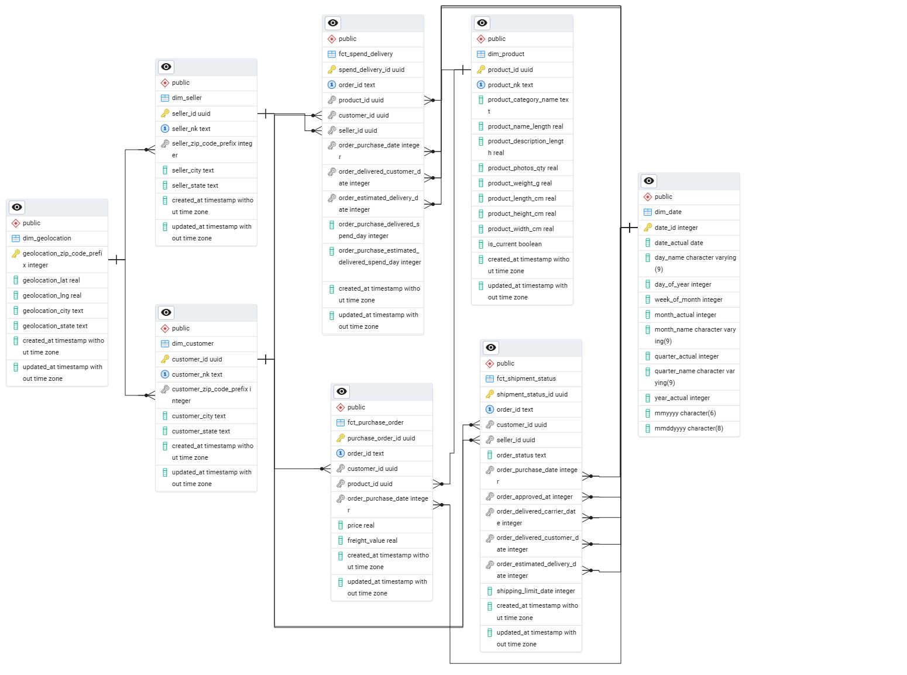

# Introduction
Repository ini merupakan lanjutan dari rancangan data warehouse pada link https://medium.com/@ilhamrizkiagn/membuat-data-warehouse-schema-untuk-marketplace-3c244f487856.

Bagian ini akan membahas tentang strategi ELT dari data source-olist hingga transformasi data ke data warehouse. Beberapa tools yang digunakan adalah sebagai berikut:
- Python: Untuk orkestrasi menggunakan Luigi. Miniconda digunakan sebagai packet management environtment python.
- PostgreSQL: Untuk menyimpan data ke dalam Database

Cronjob juga akan digunakan untuk penjadwalan proses ELT. Untuk buat env conda bisa menggunakan perintah berikut

`conda activate --name [envname]`

Kemudian lakukan install library yang dibutuhkan menggunakan command berikut

`pip install -r requirements.txt`

Repository ini dapat dijalankan via terminal dengan menjalankan `elt_main.py` bisa juga menggunakan cronjob dengan menjalankan `elt_run.sh`

## Step #1 - Requirements Gathering
Question:
1. Keputusan bisnis apa yang ingin didukung oleh data warehouse ini?
2. Pada tingkat detail (grain) apa data akan disimpan dan dianalisis?
3. Dimensi utama apa saja yang diperlukan untuk analisis (customer, produk, kota, waktu, dll)?
4. Siapa pengguna utama dan bagaimana mereka memanfaatkan laporan?
5. Seberapa sering dan seberapa cepat laporan harus tersedia?

Answer:
1. Pemantauan status pemesanan (order), Analisis perilaku pembeli (customer), dan evaluasi waktu pengiriman produk sampai ke tangan pembeli.
2. Data akan disimpan sampai tingkat item pada setiap transaksi pembeli.
3. Dimensi wajib yang disimpan adalah customer, product, order.
4. Digunakan oleh pihak marketing untuk analisis perilaku pembeli, dan logistik unuk analisis performa pengiriman.
5. Laporan harus diperbarui sehari sekali.

## Step #2 - Slowly Changing Dimension (SCD)
### SCD Type 1
Seluruh tabel dimension dan fact menggunakan SCD type 1 kecuali pada dim_product: product_category_name

Alasan: Atisipasi apabila terjadi perubahan pada data source.

### SCD Type 2
- dim_product: product_category_name

Alasan: Kategori lama masih diperlukan melacak history category sebelumnya.

### Revisi ERD
Pada langkah kali ini juga terjadi banyak penyesuaian pada arsitektur data. Diantaranya
1. dim_order ditiadakan karena banyak tabel yang seharusnya masuk ke dalam tabel fakta, bukan dimensi.
2. Penambahan kolom `is_current` pada tabel dim_product sebagai penanda apakah baris data itu yang terbaru atau tidak.
3. Penyesuaian nama kolom antara tabel dimensi dengan tabel staging. Kami melihat ada typo atau ketidaksesuaian antara kedua tabel ini.

Berikut ERD arsitektur terbaru

## Step #3 - Workflow
Workflow pada data warehouse ini adalah sebagai berikut:

Data source akan disimpan terlebih dahulu ke dalam data staging di data warehouseyang mana bertujuan untuk menyimpan data source agar dapat diaskes tim data analyst/business intelligent. Kemudian data di transformasikan di database yang sama. Adapun untuk menangani data baru dapat dilihat pada workflow berikut

